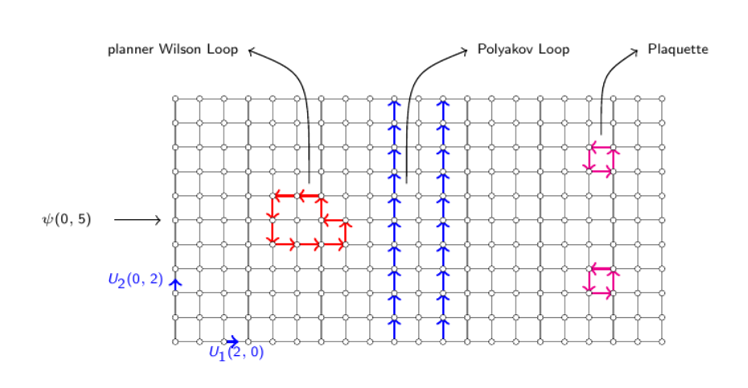
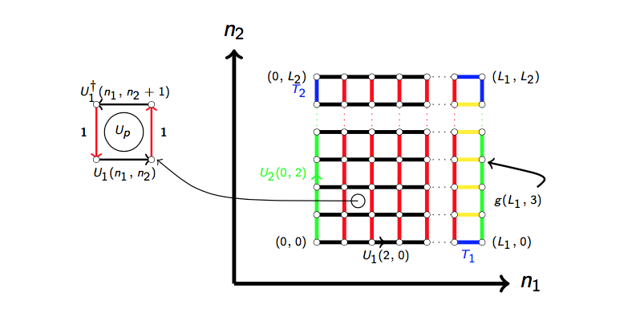
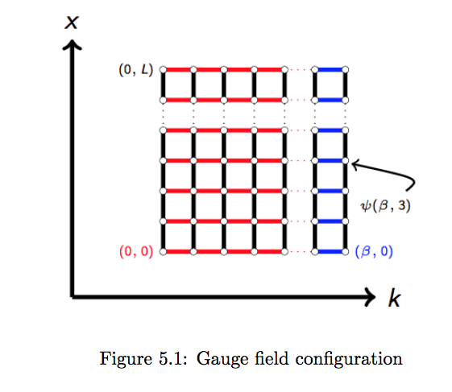

    
   Sigdel D.(Ph.D. Physics) 

 

**Find me at:** 
| [Linkedin](https://www.linkedin.com/in/sigdeld/)| [Github](https://github.com/Vasuji) |[Twitter](https://twitter.com/SigdelPhx) | [Udacity](https://profiles.udacity.com/p/4433825584) |
 
 
 I am a Physicist. Currently, my interest is in Data Science, Machine Learning and Artificial Intelligence. I have two parallel thoughts for model building perspective: simulation of a mathematical model and optimization of the proposed model over a large data set. I think more in first perspective 'simulation of a mathematical model' when we are familiar with dynamics of the system under study and explore more in that part where analytical solution does not exist. Here we technically go from model to data generation. The second part 'optimization of the proposed model' comes with machine learning which goes from data to model building (opposite to the first one). Proper feature engineering and tuning of the model parameters are the most important part of the optimization.
 
 
**Find my projects:** | [Artificial Intelligence](https://vasuji.github.io/aindinfo/) | [Self Driving Car](https://vasuji.github.io/carndinfo/) |[Machine Learning](https://vasuji.github.io/mlinfo/) | [Deep Learning](https://vasuji.github.io/mlinfo/)|

**Find my research:** | [Quantum Field Theory](https://q4quanta.github.io/qftinfo/)| [Nature Inspired Computing](https://cphysics.github.io/nicinfo/)|

**Teaching:** | [Machine Learning for Aspirants](https://teachmex.github.io/docs/) | [Computational Physics](https://cphysics.github.io/docs/) | [Algorithms](https://teachmex.github.io/algorithm/)| 

 
### Quantum Field Theory Projects:
 
 Lattice Gauge theory in n+1 dimentional space time is a system of fermion field and gaufge field in lattice of space-time.
 
 
 
 
 
 
 **[Project-1: Gauge theory in 2D without Fermions](https://github.com/q4quanta/gauge)**
 
 Built a numerical simulation of SU(N) Lattice Gauge Theory in 2 dimension without fermion content using Heat Bath Algorithm and calculated different properties. This project includes generation of SU(N) matrices, thermalization of the system and measutement of the important quantities.
 

 
 
 
 **[Project-2: Gauge theory in 2D with Fermions](https://github.com/q4quanta/fermion)**
 
  Built a numerical simulation of SU(N) Lattice Gauge Theory in 2 dimension  with fermion content using Hybrid Monte Carlo (HMC) algorithm and molecular dynamics  and calculated different properties. This project includes generation of SU(N) matrices, thermalization of the system and measutement of the important quantities.
 
 
 
 

